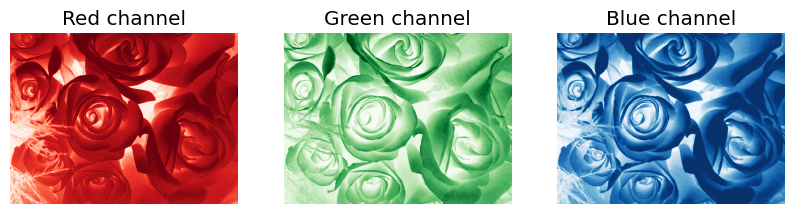
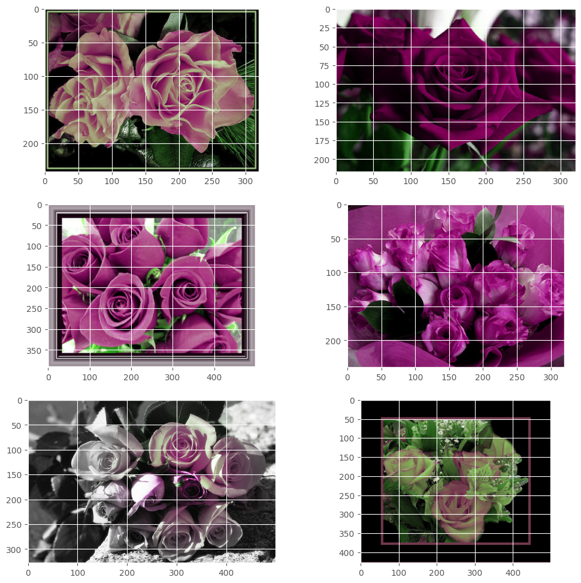

# Image Data Processing

This repository provides a collection of Python scripts that leverage the power of OpenCV (cv2) and Matplotlib to perform various image processing tasks. These scripts are designed to be modular, efficient, and easy to understand, making them suitable for both beginners and experienced image processing enthusiasts.

**Key Features**

* Image Reading and Display
* Image Transformations
* Color Space Conversion
* Image Filtering
  

### If you find this helpful 👌, please consider following and starring 🌟 this repository. Your support means a lot!😎